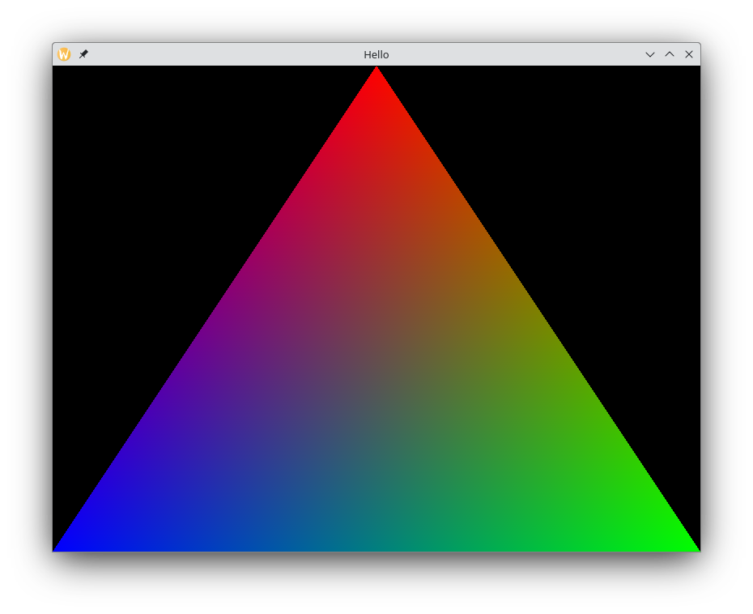

# zglgen

[](https://github.com/siniarskimar/zglgen/actions/workflows/cron-build.yml)

OpenGL bindings generator fully written in Zig.

Supports generating bindings for all versions of:
 - OpenGL
 - OpenGL Core
 - OpenGL ES
 - OpenGL SC



## Usage

The main branch of zglgen tries to work with latest official release of Zig.

### Command line

Up-to-date documentation on command line options can be found by running `zglgen -h`.

```
[-hc] [-o <file>] [--api <apispec>] [--registry <file>] <extension>...
    -h, --help
            Show this help message

    -o, --output <file>
            Destination path for the generated module (default: prints to stdout)

        --api <apispec>
            Api to generate

        --registry <file>
            File path to OpenGL registry (default: downloads https://raw.githubusercontent.com/KhronosGroup/OpenGL-Registry/main/xml/gl.xml)

    -c, --no-cache
            Disables caching of GL registry

    <extension>...
            Additional extensions
```

### Generating bindings

You can use zglgen to generate bindings on the command line or as part of your build process.

```zig
// Get zglgen executable
// -Doptimize=ReleaseSafe slows down compilation but significantly
// speeds up generation with the use of C std library
const zglgen_dep = b.dependency("zglgen", .{.optimize = .ReleaseSafe});
const zglgen_exe = zglgen_dep.artifact("zglgen");

// Use `std.Build.addRunArtifact` to generate bindings during build
const zglgen_cmd = b.addRunArtifact(zglgen_exe);
zglgen_cmd.addArg("-o");
const gl_bindings_path = zglgen_cmd.addOutputFileArg("gl.zig");

zglgen_cmd.addArgs(&[_][]const u8{
// zig fmt off
  "--api", "gl:4.6",
  "GL_KHR_debug",
// zig fmt on
});

// Create a module with generated bindings
const gl_bindings = b.createModule(.{
  .source_file = .{.path = gl_bindings_path },
});

// Add it to your executable
your_exe.addModule("gl", gl_bindings);
```

For example on how to use a generated module see [examples/triangle.zig](./examples/triangle.zig)

**NOTE**: Consider building zglgen with `ReleaseSafe` optimization.
In `Debug`, zglgen uses `std.GeneralPurposeAllocator` which is **really slow** but is necessary to fix bugs.
In `ReleaseSafe` mode, zglgen will link with C standard library and use `std.heap.c_allocator` which is substantially faster.

## FAQ

### Why the procedure table is `thread_local`?

As per [Khronos OpenGL Wiki](https://www.khronos.org/opengl/wiki/OpenGL_Context):

> The current context is a thread-local variable, so a single process can have several threads
> each of which has its own current context. However, a single context cannot be current in
> multiple threads at the same time. 

A non-thread-local procedure table is unusable for people that want to have multiple GL contexts.

1. Multiple contexts may refer to different APIs.
2. Changing contexts does not guarantee that function pointers stay the same.

### Why OpenGL constants aren't Zig enums?

Reason no. 1: **Aliases**. In Zig multiple tag names cannot refer to the same value.
I've experimented with making them as public declerations but ultimately decided to keep API consistant
and opted out to include a comment near a constant about the enum groups it belongs to.
Using LSP's `goto reference` you can find constants that uniquely belong to a single enum group.

I've also experimented with representing bitmasks as `packed structs`.
The upside is that bitfield values were easly discoverable.
The downside is that we lost the ability to perform tail calls.
Considering the bindings can potentialy be a part of a hot code path (which they most likely are), I removed them.
